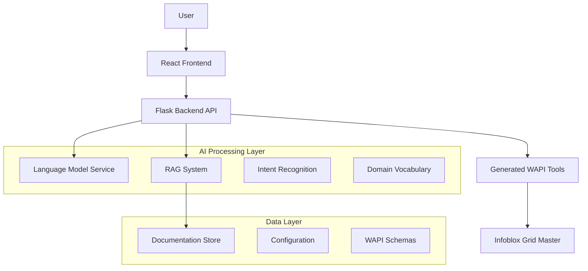

# Design Document

## Overview

The Infoblox AI Chat Interface (IACI) is a sophisticated system that bridges natural language interaction with Infoblox NIOS Web API (WAPI) operations. The system consists of a Python Flask backend that dynamically generates tools for all WAPI objects, a React frontend providing an intuitive chat interface, and an AI-powered translation layer that converts natural language queries into executable API calls with user approval and editing capabilities.

The architecture emphasizes security, user control, and intelligent context understanding through RAG-enhanced documentation and domain-specific vocabulary processing.

## Architecture

### High-Level Architecture



### Component Architecture

The system follows a layered architecture pattern:

1. **Presentation Layer**: React-based chat interface
2. **API Layer**: Flask REST API with chat endpoints
3. **Business Logic Layer**: AI translation, intent recognition, and tool orchestration
4. **Data Access Layer**: Generated WAPI tools and RAG document retrieval
5. **External Services**: Infoblox Grid Master and LLM providers

### Data Flow

1. User enters natural language query in chat interface
2. Frontend sends query to backend API with session context
3. Backend processes query through AI translation layer with caching
4. RAG system retrieves relevant documentation context
5. Intent recognition maps query to WAPI operations
6. System generates proposed API call(s) with parameters and confidence scores
7. Frontend displays proposed calls for user review/editing
8. User approves/modifies and executes calls
9. Backend executes WAPI operations with circuit breaker pattern and returns results
10. Frontend displays formatted results in chat with performance metrics

### Scalability and Performance Considerations

#### Concurrent User Handling
- **Session Management**: Each user session maintained with unique identifiers
- **Resource Limits**: Maximum 50 concurrent users per instance
- **Load Balancing**: Horizontal scaling support with stateless backend design
- **Memory Management**: LRU cache for RAG embeddings and LLM responses

#### Caching Strategy
- **LLM Response Cache**: Redis-based caching for similar queries (TTL: 1 hour)
- **RAG Document Cache**: In-memory caching of frequently accessed documentation
- **WAPI Schema Cache**: Persistent caching of schema information (TTL: 24 hours)
- **Session State Cache**: Redis-based session storage for user context

#### Performance Optimization
- **Async Processing**: Non-blocking I/O for all external API calls
- **Connection Pooling**: Persistent connections to Infoblox WAPI and LLM services
- **Batch Processing**: Support for multiple WAPI operations in single request
- **Progressive Loading**: Incremental result display for large datasets

## Components and Interfaces

### Frontend Components

#### State Management Strategy
- **Framework**: React Context API with useReducer for complex state
- **Session State**: User session, chat history, and UI preferences
- **API State**: Loading states, error handling, and response caching
- **Form State**: API call review and editing with validation
- **Offline Support**: Service worker for basic offline functionality

#### UI/UX Design System (Marriott.com Inspired)

**Color Palette:**
- Primary: `#8B0000` (Deep Red/Burgundy - Marriott brand color)
- Secondary: `#D4AF37` (Gold - Marriott accent color)
- Background: `#FFFFFF` (Clean white)
- Surface: `#F8F8F8` (Light gray for cards/containers)
- Text Primary: `#2C2C2C` (Dark gray)
- Text Secondary: `#666666` (Medium gray)
- Border: `#E0E0E0` (Light border)
- Success: `#28A745` (Green for successful operations)
- Warning: `#FFC107` (Amber for warnings)
- Error: `#DC3545` (Red for errors)

**Typography:**
- Primary Font: `'Marriott Sans', 'Helvetica Neue', Arial, sans-serif`
- Headings: Bold, clean sans-serif
- Body: Regular weight, high readability
- Code/API: `'Monaco', 'Menlo', monospace`

**Design Principles:**
- Clean, professional layout with generous white space
- Subtle shadows and rounded corners (4px-8px radius)
- Elegant hover states and smooth transitions
- Premium feel with sophisticated color usage
- Consistent spacing using 8px grid system

#### ChatInterface Component
- **Purpose**: Main chat interface container with Marriott-inspired design
- **Props**: None (root component)
- **State**: 
  - `messages`: Array of chat messages
  - `isLoading`: Boolean for loading state
  - `currentInput`: String for current user input
- **Styling**:
  - Background: Clean white with subtle texture
  - Header: Deep red (#8B0000) with gold accents
  - Layout: Centered container with max-width for readability
  - Shadows: Subtle elevation for depth
- **Methods**:
  - `sendMessage(message)`: Sends message to backend
  - `handleResponse(response)`: Processes backend response
  - `displayResults(data)`: Formats and displays API results

#### MessageList Component
- **Purpose**: Displays chat message history with Marriott-style elegance
- **Props**: 
  - `messages`: Array of message objects
- **Styling**:
  - User messages: Right-aligned with deep red background (#8B0000)
  - Assistant messages: Left-aligned with light gray background (#F8F8F8)
  - Message bubbles: Rounded corners (12px), subtle shadows
  - Spacing: Generous padding and margins for readability
  - Typography: Clean, professional font hierarchy
- **Methods**:
  - `renderMessage(message)`: Renders individual message with Marriott styling
  - `formatNetworkData(data)`: Formats network data in elegant tables

#### InputField Component
- **Purpose**: Premium text input with auto-suggestions, Marriott-inspired design
- **Props**:
  - `onSend`: Callback for sending messages
  - `suggestions`: Array of suggestion objects
- **State**:
  - `inputValue`: Current input text
  - `showSuggestions`: Boolean for suggestion visibility
- **Styling**:
  - Input field: Clean white background with gold accent border on focus
  - Send button: Deep red (#8B0000) with gold hover state
  - Suggestions dropdown: White background with subtle shadow
  - Icons: Gold color (#D4AF37) for visual hierarchy
- **Methods**:
  - `handleInputChange(value)`: Updates input and fetches suggestions
  - `selectSuggestion(suggestion)`: Applies selected suggestion

#### APICallReview Component
- **Purpose**: Elegant review interface for proposed API calls
- **Props**:
  - `proposedCalls`: Array of API call objects
  - `onApprove`: Callback for approval
  - `onEdit`: Callback for editing
  - `onCancel`: Callback for cancellation
- **Styling**:
  - Container: White background with subtle border and shadow
  - Headers: Deep red (#8B0000) with gold accents
  - Parameters: Clean table layout with alternating row colors
  - Buttons: Primary (red), Secondary (gold), Cancel (gray)
  - Edit mode: Inline form fields with validation styling
- **Methods**:
  - `renderCallDetails(call)`: Displays call parameters in elegant format
  - `enableEditing(callId)`: Enables parameter editing with smooth transitions
  - `validateParameters(call)`: Validates edited parameters with visual feedback

#### Header Component
- **Purpose**: Premium header with Marriott branding elements
- **Styling**:
  - Background: Deep red (#8B0000) gradient
  - Logo area: Gold accent (#D4AF37)
  - Navigation: Clean, minimal design
  - Typography: Bold, professional font

#### LoadingSpinner Component
- **Purpose**: Elegant loading indicator
- **Styling**:
  - Spinner: Gold color (#D4AF37) with smooth animation
  - Background: Semi-transparent overlay
  - Text: Professional loading messages

#### StatusIndicator Component
- **Purpose**: Visual feedback for system status
- **Styling**:
  - Success: Green with checkmark icon
  - Warning: Amber with warning icon
  - Error: Red with error icon
  - Info: Gold with info icon

### Backend Components

#### Flask Application (`app.py`)
- **Purpose**: Main application server and API endpoints
- **Endpoints**:
  - `POST /api/chat`: Process chat messages
  - `GET /api/suggestions`: Get auto-suggestions
  - `POST /api/execute`: Execute approved API calls
  - `GET /api/schema/{object}`: Get WAPI object schema
- **Dependencies**: Configuration, Tools, AI Processor, RAG System

#### Configuration Manager (`config.py`)
- **Purpose**: Manages system configuration and credentials
- **Methods**:
  - `load_config()`: Loads configuration from files and environment
  - `get_infoblox_config()`: Returns Infoblox connection details
  - `get_llm_config()`: Returns LLM provider configuration
  - `validate_config()`: Validates configuration completeness
  - `get_performance_config()`: Returns performance and scaling settings
  - `get_cache_config()`: Returns caching configuration

#### Tool Generator (`tool_generator.py`)
- **Purpose**: Dynamically generates WAPI tools from schemas
- **Methods**:
  - `fetch_schema()`: Retrieves WAPI schema from Grid Master
  - `generate_tools()`: Creates Python functions for each WAPI object
  - `create_crud_functions(object_name, schema)`: Generates CRUD operations
  - `validate_tool_parameters(call, schema)`: Validates API call parameters

#### AI Processor (`ai_processor.py`)
- **Purpose**: Handles natural language processing and intent recognition with LLM integration
- **Methods**:
  - `process_query(query, context)`: Main query processing pipeline with caching
  - `extract_entities(text)`: Identifies network entities (IPs, hostnames, etc.)
  - `recognize_intent(query)`: Maps query to WAPI operations with confidence scoring
  - `generate_api_calls(intent, entities)`: Creates proposed API calls with validation
  - `enhance_with_rag(query)`: Adds relevant documentation context
  - `fallback_processing(query)`: Keyword-based processing when LLM unavailable
  - `validate_llm_response(response)`: Ensures LLM response quality and format

#### LLM Integration (`llm_client.py`)
- **Purpose**: Manages communication with various LLM providers with fallback strategies
- **Methods**:
  - `send_request(prompt, provider)`: Send request with circuit breaker pattern
  - `format_prompt(query, context)`: Create optimized prompts for WAPI operations
  - `parse_response(response)`: Extract structured data from LLM responses
  - `handle_provider_failure(error)`: Implement fallback and retry logic
  - `cache_response(query, response)`: Cache successful responses
  - `get_cached_response(query)`: Retrieve cached responses

#### Circuit Breaker (`circuit_breaker.py`)
- **Purpose**: Implements circuit breaker pattern for external service calls
- **Methods**:
  - `call_with_breaker(func, *args)`: Execute function with circuit breaker protection
  - `record_success()`: Record successful operation
  - `record_failure()`: Record failed operation and update circuit state
  - `is_circuit_open()`: Check if circuit is open (failing)
  - `reset_circuit()`: Reset circuit after recovery period

#### RAG System (`rag_system.py`)
- **Purpose**: Retrieval-Augmented Generation for documentation context
- **Methods**:
  - `initialize_documents()`: Loads and indexes documentation
  - `retrieve_context(query)`: Finds relevant documentation snippets
  - `build_vocabulary()`: Creates domain-specific vocabulary
  - `update_embeddings()`: Updates document embeddings

#### Domain Vocabulary (`vocabulary.py`)
- **Purpose**: Manages Infoblox and networking terminology
- **Methods**:
  - `load_vocabulary()`: Loads vocabulary from files and schemas
  - `add_terms(terms)`: Adds new terms to vocabulary
  - `get_synonyms(term)`: Returns synonyms for network terms
  - `validate_entity(entity, type)`: Validates network entities

### External Interfaces

#### Infoblox WAPI Interface
- **Protocol**: HTTPS REST API
- **Authentication**: Basic authentication with admin credentials
- **Base URL**: `https://{grid_ip}/wapi/{version}/`
- **Operations**: GET, POST, PUT, DELETE for all WAPI objects
- **Response Format**: JSON

#### LLM Provider Interface
- **Supported Providers**: OpenAI, Claude, Grok, Llama, Gemini
- **Protocol**: HTTPS REST API or custom endpoints
- **Authentication**: API key or custom authentication
- **Request Format**: JSON with messages and context
- **Response Format**: JSON with generated text

## Data Models

### Configuration Models

```python
@dataclass
class SystemConfig:
    infoblox: InfobloxConfig
    llm: LLMConfig
    performance: PerformanceConfig
    cache: CacheConfig

@dataclass
class InfobloxConfig:
    grid_ip: str
    admin_user: str
    admin_pass: str
    network_view: str = "default"
    wapi_version: str = "v2.13.1"
    verify_ssl: bool = False
    connection_timeout: int = 30
    max_retries: int = 3

@dataclass
class LLMConfig:
    provider: str
    api_key: str
    base_url: Optional[str] = None
    model: Optional[str] = None
    temperature: float = 0.7
    max_tokens: int = 4000
    timeout: int = 30
    fallback_enabled: bool = True

@dataclass
class PerformanceConfig:
    max_concurrent_users: int = 50
    response_timeout: int = 30
    batch_size: int = 10
    enable_metrics: bool = True

@dataclass
class CacheConfig:
    redis_url: Optional[str] = None
    llm_cache_ttl: int = 3600
    schema_cache_ttl: int = 86400
    enable_cache: bool = True
```

### Chat Models

```python
@dataclass
class ChatMessage:
    id: str
    content: str
    sender: str  # "user" or "assistant"
    timestamp: datetime
    message_type: str  # "text", "api_call", "result"
    metadata: Optional[Dict] = None

@dataclass
class APICallProposal:
    id: str
    operation: str  # WAPI object name
    method: str  # GET, POST, PUT, DELETE
    parameters: Dict[str, Any]
    description: str
    confidence: float
    required_fields: List[str]
    optional_fields: List[str]
```

### WAPI Models

```python
@dataclass
class WAPIObject:
    name: str
    fields: Dict[str, FieldDefinition]
    supports: List[str]  # ['r', 'w', 'u', 'd', 's']
    base_url: str

@dataclass
class FieldDefinition:
    name: str
    type: str
    required: bool
    searchable: bool
    description: str
    enum_values: Optional[List[str]] = None
```

### RAG Models

```python
@dataclass
class DocumentChunk:
    id: str
    content: str
    source: str
    metadata: Dict[str, Any]
    embedding: Optional[List[float]] = None

@dataclass
class VocabularyTerm:
    term: str
    category: str  # "object", "operation", "network_concept"
    synonyms: List[str]
    definition: str
    examples: List[str]
```

## Error Handling

### Error Categories

1. **Configuration Errors**
   - Missing or invalid credentials
   - Unreachable Infoblox Grid Master
   - Invalid LLM configuration

2. **Authentication Errors**
   - Invalid Infoblox credentials
   - Expired or invalid LLM API keys
   - Insufficient permissions

3. **API Errors**
   - WAPI operation failures
   - Invalid parameters or constraints
   - Network connectivity issues

4. **Processing Errors**
   - Natural language processing failures
   - Intent recognition ambiguity
   - RAG system retrieval errors

### Error Handling Strategy

#### Frontend Error Handling
```javascript
// Error display component
const ErrorMessage = ({ error, onRetry, onDismiss }) => {
  const getErrorMessage = (error) => {
    switch (error.type) {
      case 'network':
        return 'Connection failed. Please check your network.';
      case 'authentication':
        return 'Authentication failed. Please check credentials.';
      case 'validation':
        return `Invalid parameters: ${error.details}`;
      default:
        return 'An unexpected error occurred.';
    }
  };
  
  return (
    <div className="error-message">
      <p>{getErrorMessage(error)}</p>
      {onRetry && <button onClick={onRetry}>Retry</button>}
      <button onClick={onDismiss}>Dismiss</button>
    </div>
  );
};
```

#### Backend Error Handling
```python
class APIError(Exception):
    def __init__(self, message, error_type, details=None):
        self.message = message
        self.error_type = error_type
        self.details = details
        super().__init__(message)

def handle_api_error(func):
    def wrapper(*args, **kwargs):
        try:
            return func(*args, **kwargs)
        except requests.exceptions.ConnectionError:
            raise APIError("Connection failed", "network")
        except requests.exceptions.HTTPError as e:
            if e.response.status_code == 401:
                raise APIError("Authentication failed", "authentication")
            else:
                raise APIError(f"API error: {e}", "api", str(e))
        except Exception as e:
            raise APIError(f"Unexpected error: {e}", "unknown", str(e))
    return wrapper
```

### Graceful Degradation

1. **LLM Service Unavailable**: Fall back to keyword-based intent recognition
2. **RAG System Failure**: Use basic WAPI documentation without context enhancement
3. **Partial Schema Loading**: Continue with available objects, log missing ones
4. **Network Intermittency**: Implement retry logic with exponential backoff

## Testing Strategy

### Unit Testing

#### Frontend Testing
- **Framework**: Jest + React Testing Library
- **Coverage**: All components, utility functions, and hooks
- **Test Types**:
  - Component rendering and interaction
  - State management and props handling
  - API call mocking and response handling
  - User input validation and formatting

#### Backend Testing
- **Framework**: pytest
- **Coverage**: All modules, functions, and API endpoints
- **Test Types**:
  - Tool generation from mock schemas
  - AI processing with mock LLM responses
  - RAG system document retrieval
  - Configuration loading and validation

### Integration Testing

#### API Integration Tests
```python
class TestAPIIntegration:
    def test_chat_endpoint_flow(self):
        # Test complete chat message processing
        response = client.post('/api/chat', json={
            'message': 'Show me all A records in zone example.com'
        })
        assert response.status_code == 200
        assert 'proposed_calls' in response.json
        
    def test_execute_endpoint_with_approval(self):
        # Test API call execution after user approval
        call_data = {
            'operation': 'record:a',
            'method': 'GET',
            'parameters': {'zone': 'example.com'}
        }
        response = client.post('/api/execute', json=call_data)
        assert response.status_code == 200
```

#### End-to-End Testing
- **Framework**: Playwright or Cypress
- **Scenarios**:
  - Complete user workflow from query to result
  - API call review and editing process
  - Error handling and recovery
  - Multi-step operations

### Performance Testing

#### Load Testing
- **Tool**: pytest-benchmark for backend, Lighthouse for frontend
- **Metrics**:
  - Response time for chat queries
  - Tool generation performance
  - RAG retrieval speed
  - Frontend rendering performance

#### Stress Testing
- **Scenarios**:
  - Concurrent user sessions
  - Large result set handling
  - Memory usage with extensive documentation
  - Network timeout handling

### Security Testing

#### Authentication Testing
- **Credential validation**: Test invalid/expired credentials
- **Session management**: Test session timeout and renewal
- **API key security**: Ensure keys are not exposed in logs

#### Input Validation Testing
- **SQL injection**: Test WAPI parameter injection
- **XSS prevention**: Test frontend input sanitization
- **Parameter validation**: Test schema constraint enforcement

### Frontend Styling Implementation

#### CSS Architecture
```css
/* Marriott-inspired CSS Variables */
:root {
  --marriott-red: #8B0000;
  --marriott-gold: #D4AF37;
  --background-white: #FFFFFF;
  --surface-gray: #F8F8F8;
  --text-primary: #2C2C2C;
  --text-secondary: #666666;
  --border-light: #E0E0E0;
  --success-green: #28A745;
  --warning-amber: #FFC107;
  --error-red: #DC3545;
  
  --font-primary: 'Marriott Sans', 'Helvetica Neue', Arial, sans-serif;
  --font-mono: 'Monaco', 'Menlo', monospace;
  
  --border-radius: 8px;
  --border-radius-small: 4px;
  --border-radius-large: 12px;
  
  --shadow-subtle: 0 2px 4px rgba(0,0,0,0.1);
  --shadow-medium: 0 4px 8px rgba(0,0,0,0.15);
  --shadow-large: 0 8px 16px rgba(0,0,0,0.2);
  
  --transition-fast: 0.2s ease;
  --transition-medium: 0.3s ease;
}

/* Component Styling Examples */
.chat-interface {
  background: var(--background-white);
  font-family: var(--font-primary);
  min-height: 100vh;
}

.message-user {
  background: var(--marriott-red);
  color: white;
  border-radius: var(--border-radius-large);
  padding: 12px 16px;
  margin-left: auto;
  max-width: 70%;
  box-shadow: var(--shadow-subtle);
}

.message-assistant {
  background: var(--surface-gray);
  color: var(--text-primary);
  border-radius: var(--border-radius-large);
  padding: 12px 16px;
  margin-right: auto;
  max-width: 70%;
  box-shadow: var(--shadow-subtle);
}

.input-field {
  border: 2px solid var(--border-light);
  border-radius: var(--border-radius);
  padding: 12px 16px;
  font-family: var(--font-primary);
  transition: border-color var(--transition-fast);
}

.input-field:focus {
  border-color: var(--marriott-gold);
  outline: none;
  box-shadow: 0 0 0 3px rgba(212, 175, 55, 0.1);
}

.button-primary {
  background: var(--marriott-red);
  color: white;
  border: none;
  border-radius: var(--border-radius);
  padding: 12px 24px;
  font-family: var(--font-primary);
  font-weight: 600;
  cursor: pointer;
  transition: background-color var(--transition-fast);
}

.button-primary:hover {
  background: var(--marriott-gold);
}

.api-call-review {
  background: var(--background-white);
  border: 1px solid var(--border-light);
  border-radius: var(--border-radius);
  box-shadow: var(--shadow-medium);
  padding: 24px;
  margin: 16px 0;
}
```

#### Responsive Design
- **Mobile-first approach**: Optimized for mobile devices
- **Breakpoints**: 
  - Mobile: 320px - 768px
  - Tablet: 768px - 1024px  
  - Desktop: 1024px+
- **Touch-friendly**: Larger touch targets on mobile
- **Adaptive layout**: Flexible grid system

### Test Data Management

#### Mock Data Strategy
```python
# Mock WAPI responses
MOCK_SCHEMA_RESPONSE = {
    "supported_objects": ["record:a", "record:cname", "network"],
    "record:a": {
        "fields": {
            "name": {"type": "string", "required": True},
            "ipv4addr": {"type": "string", "required": True}
        }
    }
}

# Mock LLM responses
MOCK_LLM_RESPONSE = {
    "intent": "search",
    "entities": {"zone": "example.com", "record_type": "A"},
    "confidence": 0.95
}
```

#### Test Environment Setup
- **Docker containers**: Isolated test environments
- **Mock services**: Simulated Infoblox and LLM endpoints
- **Test databases**: Separate test data storage
- **CI/CD integration**: Automated testing in build pipeline